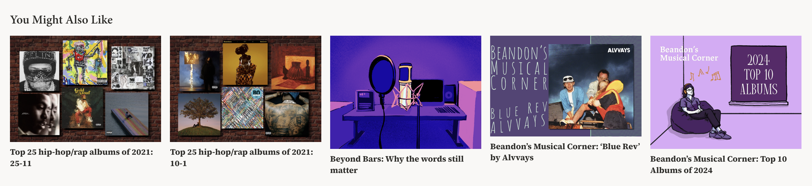

# Stanford Daily Recommender

A Chrome extension that adds a "You Might Also Like" section to Stanford Daily articles, using text embeddings to recommend similar stories — built entirely from article content rather than user behavior data.

## How it works

1. **Data pipeline (Python)** — pulls articles from the Stanford Daily's WordPress REST API, cleans the HTML content, and generates semantic embeddings using sentence-transformers.
2. **Similarity engine** — computes cosine similarity between every pair of articles to find each article's most topically related stories.
3. **Browser extension (JS)** — injects a styled recommendation panel directly into the live article page, matching the Daily's visual identity.

## Tech stack

- Python: requests, BeautifulSoup, sentence-transformers, scikit-learn, numpy
- JavaScript: Chrome Extension (Manifest V3), vanilla DOM manipulation
- Data: ~7,700 articles (last 5 years), pulled via WordPress REST API

## Project structure

pipeline/       Python scripts: fetch, clean, embed, recommend
extension/      Chrome extension: manifest, content script, styles
data/           Generated JSON files

## Running it locally

1. cd pipeline && pip install -r requirements.txt
2. Run scripts in order: fetch_articles.py, clean_text.py, build_embeddings.py, build_recommendations.py
3. Copy data/recommendations.json into extension/
4. Load extension/ as an unpacked extension in Chrome (chrome://extensions, Developer mode, Load unpacked)

